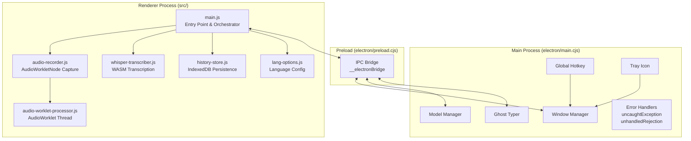
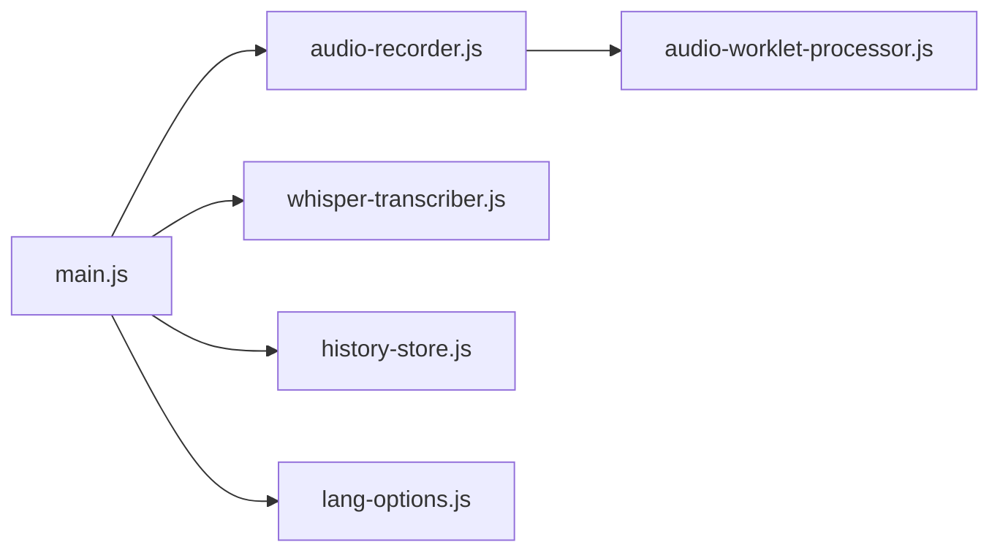
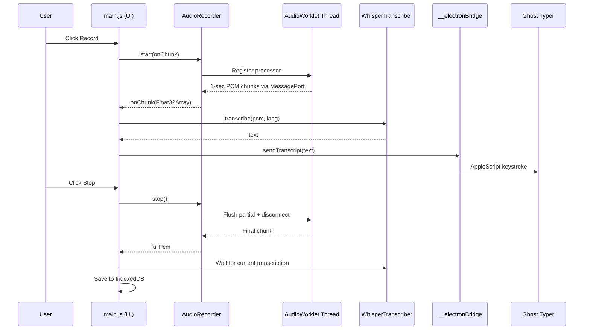

# Design Document: Phase 1 — Electron High-Performance Renderer

## Overview

This design transforms the annadata-vad-dt Electron desktop app from a monolithic, dual-codebase renderer with deprecated audio APIs and no error handling into a consolidated, modular ES-module architecture with modern AudioWorkletNode capture, comprehensive error boundaries, and reliable UI responsiveness.

### Current State

The project has two parallel renderer codebases:
- `renderer/` — monolithic IIFE (`app.js`) loaded by `electron/main.cjs`, currently active
- `src/` — ES module-based (`main.js`, `audio-recorder.js`, `whisper-transcriber.js`, `history-store.js`, `lang-options.js`), unused since Vite removal

Both use the deprecated `ScriptProcessorNode` for audio capture. The active `renderer/app.js` inlines all logic (audio, transcription, history, language selection) in a single IIFE with zero error handling. The `-webkit-app-region: drag` CSS on the `#app` container intercepts pointer events, making buttons unresponsive.

### Target State

A single consolidated renderer in `src/` using ES modules, loaded directly by Electron (no build tools). AudioWorkletNode replaces ScriptProcessorNode. Every async boundary (getUserMedia, WASM init, model download, IPC, transcription) has error handling with user-visible feedback. The overlay window dynamically resizes for dropdowns/history. Ghost typing degrades gracefully on non-macOS platforms.

### Key Constraints

- Electron 35, no build tools — direct file loading via `loadFile()`
- `package.json` has `"type": "module"` but Electron main/preload use `.cjs` extension
- whisper.cpp WASM with `nThreads=1` (single thread to avoid SharedArrayBuffer/pthread crashes)
- Models stored in `/Users/Shared/annadata-vad-dt/models/` (macOS)
- Ghost typing via macOS AppleScript only (fire-and-forget)
- `libs/wasm/whisper.js` is a pre-built Emscripten module loaded via `<script>` tag

## Architecture

### High-Level Architecture



### Module Dependency Graph



### Data Flow: Recording Session



## Components and Interfaces

### 1. `src/main.js` — Entry Point & Orchestrator

The single entry point that wires DOM events, module interactions, and IPC bridge listeners.

```typescript
// Responsibilities:
// - DOM element references and event listeners
// - Recording state machine (idle → recording → stopping → idle)
// - Transcription loop coordination
// - Window resize requests via IPC
// - Error display in text overlay

// State:
interface AppState {
  recording: boolean;
  transcribing: boolean;
  currentLang: string;       // language code, default 'en'
  historyOpen: boolean;
  langDropdownOpen: boolean;
  sessionTranscript: string;
  chunkQueue: Float32Array[];
  abortController: AbortController | null;
}
```

Key behaviors:
- All buttons have `pointerdown` or `click` listeners with `-webkit-app-region: no-drag` on all interactive elements
- `startRecording()` checks model loaded, then calls `recorder.start(onChunk)`
- `stopRecording()` sets `recording = false`, signals abort, awaits `recorder.stop()`, waits for transcription to drain
- `transcribeLoop()` processes `chunkQueue` in FIFO order; on error, logs and skips chunk
- Error messages displayed via `setText(msg)` in the `#textOverlay` element

### 2. `src/audio-recorder.js` — AudioWorkletNode Capture

```typescript
export class AudioRecorder {
  // Public API
  async start(onChunk: (chunk: Float32Array) => void): Promise<void>;
  async stop(): Promise<Float32Array>;  // returns full session PCM
  isRecording(): boolean;

  // Events
  onError: ((error: Error) => void) | null;
}
```

Implementation details:
- Requests `getUserMedia({ audio: { channelCount: 1, sampleRate: 16000, echoCancellation: true, noiseSuppression: true } })`
- Creates `AudioContext({ sampleRate: 16000 })`
- Registers `audio-worklet-processor.js` via `audioContext.audioWorklet.addModule()`
- Creates `AudioWorkletNode` connected to the media stream source
- Receives 1-second (16000-sample) chunks via `MessagePort` from the worklet
- On `stop()`: sends `{ command: 'flush' }` to worklet, waits for final chunk, disconnects graph, closes context, stops tracks
- Fallback: if `audioContext.audioWorklet` is undefined, falls back to `ScriptProcessorNode` with console warning

### 3. `src/audio-worklet-processor.js` — AudioWorklet Thread

```javascript
// Runs on audio thread, NOT an ES module (loaded via addModule)
class ChunkProcessor extends AudioWorkletProcessor {
  constructor() {
    super();
    this._buffer = new Float32Array(16000); // 1 sec at 16kHz
    this._writePos = 0;
    this._active = true;
    this.port.onmessage = (e) => {
      if (e.data.command === 'flush') {
        this._flush();
        this._active = false;
      }
    };
  }

  process(inputs) {
    if (!this._active) return false;
    const input = inputs[0]?.[0];
    if (!input) return true;
    // Copy samples into buffer, flush when full
    // ... (accumulate and post 16000-sample chunks)
    return true;
  }

  _flush() {
    if (this._writePos > 0) {
      const partial = this._buffer.slice(0, this._writePos);
      this.port.postMessage({ type: 'chunk', data: partial }, [partial.buffer]);
      this._writePos = 0;
    }
  }
}
registerProcessor('chunk-processor', ChunkProcessor);
```

### 4. `src/whisper-transcriber.js` — WASM Transcription

```typescript
export class WhisperTranscriber {
  // Public API
  async loadModel(url: string, onProgress?: (msg: string) => void): Promise<void>;
  transcribe(pcm: Float32Array, lang: string): string;
  isModelLoaded(): boolean;
}
```

Implementation details:
- `loadModel()`: initializes `WhisperModule`, loads model bytes (via IPC bridge for Electron, fetch for web), writes to WASM FS, calls `wmod.init(path, false, 1)` with `nThreads=1`
- `transcribe()`: allocates WASM memory via `wasm_malloc`, copies PCM, calls `wmod.transcribe()`, always frees via `wasm_free` in `finally` block
- Error handling: `wasm_malloc` null → log + return empty string; `transcribe()` exception → log + skip chunk + return empty string; `init()` failure → throw descriptive error

### 5. `src/history-store.js` — IndexedDB Persistence

```typescript
// Public API (unchanged from current)
export async function saveRecording(entry: {
  lang: string;
  audio: Float32Array;
  transcript: string;
}): Promise<number>;

export async function getHistory(limit?: number): Promise<Array<{
  id: number;
  timestamp: number;
  lang: string;
  audio: Float32Array;
  transcript: string;
}>>;
```

No changes needed — the existing `src/history-store.js` already has the correct API and implementation.

### 6. `src/lang-options.js` — Language Configuration

```typescript
// Public API (unchanged from current)
export const langOptions: Record<string, {
  name: string;
  whisper: string;
  url: string | null;
}>;
```

No changes needed — the existing module is already correct.

### 7. `electron/preload.cjs` — IPC Bridge (Enhanced)

```javascript
// Enhanced with try-catch wrappers on invoke calls
contextBridge.exposeInMainWorld('__electronBridge', {
  onRecordingState: (cb) => ipcRenderer.on('recording-state', (_, val) => cb(val)),
  sendTranscript: (text) => ipcRenderer.send('transcript', text),
  sendFinalTranscript: (text) => ipcRenderer.send('final-transcript', text),
  resizeWindow: (w, h) => ipcRenderer.send('resize-window', w, h),

  // Wrapped invoke calls — return { success, error } on failure
  isModelDownloaded: (url) => safeInvoke('is-model-downloaded', url),
  getModelPath: (url) => safeInvoke('get-model-path', url),
  readModelFile: (path) => safeInvoke('read-model-file', path),
  downloadModel: (url) => safeInvoke('download-model', url),
  onDownloadProgress: (cb) => ipcRenderer.on('download-progress', (_, data) => cb(data)),
});

async function safeInvoke(channel, ...args) {
  try {
    return await ipcRenderer.invoke(channel, ...args);
  } catch (err) {
    return { success: false, error: err.message || 'IPC call failed' };
  }
}
```

### 8. `electron/main.cjs` — Main Process (Enhanced)

Additions:
- `process.on('uncaughtException', ...)` — log and prevent crash
- `process.on('unhandledRejection', ...)` — log rejected promise
- IPC handlers wrapped in try-catch returning structured errors
- `downloadModel()` deletes `.tmp` files before retry
- Ghost typer: platform check, fire-and-forget, error logged silently
- Window resize: validates dimensions before applying

### 9. CSS Changes (`src/styles.css`)

Key changes for drag region handling:
```css
/* Drag handle: only the body background area, not #app */
body {
  -webkit-app-region: drag;
}

#app {
  -webkit-app-region: no-drag;
}

/* All interactive elements explicitly no-drag */
.icon-btn, #langWrap, .lang-dropdown, .lang-option,
#centerCol, #historyList, .history-item, .hi-play {
  -webkit-app-region: no-drag;
}
```

### 10. `src/index.html` — Entry Point HTML

Changes:
- Script tag for `whisper.js` points to `../libs/wasm/whisper.js` (relative from `src/`)
- Entry module: `<script type="module" src="./main.js"></script>`
- AudioWorklet processor loaded programmatically by `audio-recorder.js`

### Electron Main Process Loading Change

```javascript
// electron/main.cjs — change loadFile path
const indexPath = path.join(__dirname, '..', 'src', 'index.html');
mainWindow.loadFile(indexPath);
```

## Data Models

### Application State

```
AppState {
  recording: boolean          // true while mic is active
  transcribing: boolean       // true while transcribe loop is running
  currentLang: string         // ISO 639-1 code (e.g., 'en', 'hi')
  historyOpen: boolean        // history panel visibility
  langDropdownOpen: boolean   // language dropdown visibility
  sessionTranscript: string   // accumulated text for current session
  chunkQueue: Float32Array[]  // FIFO queue of PCM chunks awaiting transcription
  abortController: AbortController | null  // cancellation signal for stop
}
```

### AudioRecorder Internal State

```
AudioRecorderState {
  stream: MediaStream | null
  audioCtx: AudioContext | null
  workletNode: AudioWorkletNode | null
  allChunks: Float32Array[]   // all chunks for full session merge
  allSamples: number          // total sample count
  recording: boolean
  onChunk: ((chunk: Float32Array) => void) | null
  onError: ((error: Error) => void) | null
}
```

### WhisperTranscriber Internal State

```
WhisperTranscriberState {
  wasmModule: WhisperModule | null
  contextId: number | null
  loadedModelFile: string | null
}
```

### IndexedDB Schema

```
Database: 'annadata-vad-history', version 1
Object Store: 'recordings'
  keyPath: 'id' (autoIncrement)
  Index: 'timestamp'

Record {
  id: number              // auto-incremented
  timestamp: number       // Date.now() at save time
  lang: string            // ISO 639-1 code
  audio: Float32Array     // PCM 16kHz mono
  transcript: string      // full session transcript
}
```

### IPC Message Types

```
Renderer → Main (invoke, returns Promise):
  'is-model-downloaded'  (url: string) → boolean
  'get-model-path'       (url: string) → string | null
  'read-model-file'      (path: string) → ArrayBuffer | null
  'download-model'       (url: string) → { success: boolean, error?: string }

Renderer → Main (send, fire-and-forget):
  'transcript'           (text: string)
  'final-transcript'     (text: string)
  'resize-window'        (w: number, h: number)

Main → Renderer (send):
  'recording-state'      (active: boolean)
  'download-progress'    ({ loaded, total, percentage })
```

### Language Option Schema

```
LangOption {
  name: string            // Display name (e.g., 'English', 'हिन्दी')
  whisper: string         // Whisper language code
  url: string | null      // HuggingFace model URL, null = unavailable
}
```


## Correctness Properties

*A property is a characteristic or behavior that should hold true across all valid executions of a system — essentially, a formal statement about what the system should do. Properties serve as the bridge between human-readable specifications and machine-verifiable correctness guarantees.*

### Property 1: AudioWorklet chunk boundary invariant

*For any* sequence of variably-sized input audio buffers fed to the ChunkProcessor, the processor SHALL only emit chunks of exactly 16000 samples (except for the final flush), and no samples shall be emitted before the buffer accumulates 16000 samples.

**Validates: Requirements 3.2, 3.3**

### Property 2: Audio capture sample conservation

*For any* sequence of input audio samples of arbitrary total length, the sum of all emitted chunk lengths (including the final partial flush) SHALL equal the total number of input samples. No samples are lost or duplicated.

**Validates: Requirements 3.4**

### Property 3: Transcription pipeline chunk-error resilience

*For any* sequence of PCM chunks in the Chunk_Queue where some chunks cause `transcribe()` to throw, the Transcription_Pipeline SHALL continue processing all remaining non-failing chunks. The number of successfully processed chunks plus the number of failed chunks SHALL equal the total queue length.

**Validates: Requirements 6.3**

### Property 4: WASM memory deallocation invariant

*For any* call to `transcribe()` where `wasm_malloc` returns a non-null pointer, `wasm_free` SHALL be called on that pointer regardless of whether the transcription succeeds or throws an exception. The count of `wasm_free` calls SHALL equal the count of successful `wasm_malloc` calls.

**Validates: Requirements 6.5**

### Property 5: IPC bridge error wrapping

*For any* IPC invoke call that rejects with an error, the `safeInvoke` wrapper SHALL return an object with `{ success: false, error: string }` rather than throwing. The returned error string SHALL be non-empty.

**Validates: Requirements 8.1**

### Property 6: Chunk processing FIFO order

*For any* sequence of PCM chunks added to the Chunk_Queue, the Transcription_Pipeline SHALL process them in the exact order they were enqueued. If chunks are labeled 1..N, the processing order SHALL be 1, 2, ..., N.

**Validates: Requirements 10.3**

### Property 7: Ghost typing never throws

*For any* transcript string (including empty strings, strings with special characters, and unicode), calling the ghost typing function SHALL never throw an exception, regardless of platform or AppleScript execution outcome. The function SHALL return without error.

**Validates: Requirements 11.2, 11.3**

## Error Handling

### Error Handling Strategy

Errors are categorized by source and handled at the appropriate boundary:

| Error Source | Handler | User Feedback | Recovery |
|---|---|---|---|
| `getUserMedia` NotAllowedError | `audio-recorder.js` → `main.js` | "Microphone access denied" | Reset to idle |
| `getUserMedia` NotFoundError | `audio-recorder.js` → `main.js` | "No microphone found" | Reset to idle |
| AudioContext init failure | `audio-recorder.js` → `main.js` | "Audio system error" | Reset to idle |
| AudioWorklet disconnect | `audio-recorder.js` onError | "Recording interrupted" | Stop recording gracefully |
| WhisperModule init failure | `whisper-transcriber.js` throws | "Transcription engine failed to load" | Reset to idle |
| whisper.init() invalid context | `whisper-transcriber.js` throws | "Model initialization failed" | Reset to idle |
| whisper.transcribe() exception | `whisper-transcriber.js` catches | (silent — skip chunk) | Continue next chunk |
| wasm_malloc null | `whisper-transcriber.js` catches | (silent — log warning) | Skip chunk, return '' |
| Model download network error | `main.cjs` returns error object | "Download failed: {message}" | User can retry |
| Model file corrupted | `main.js` detects init failure | "Model corrupted, re-downloading..." | Delete + re-download |
| IPC invoke failure | `preload.cjs` safeInvoke | Depends on context | Return structured error |
| IPC handler exception | `main.cjs` try-catch | (silent — log) | Return structured error |
| uncaughtException | `main.cjs` process handler | (silent — log) | Prevent crash |
| unhandledRejection | `main.cjs` process handler | (silent — log) | Prevent crash |
| AppleScript failure | `main.cjs` ghostType | (silent — log) | Continue processing |

### Error Flow Diagram

```mermaid
graph TD
    subgraph "Renderer Error Boundaries"
        A[startRecording] -->|getUserMedia error| B[Display error + reset UI]
        A -->|AudioContext error| B
        C[transcribeLoop] -->|transcribe error| D[Log + skip chunk]
        C -->|wasm_malloc null| D
        E[downloadAndLoadModel] -->|download error| F[Display download failed]
        E -->|init error| G[Display model failed]
        E -->|corrupt model| H[Delete + re-download]
    end

    subgraph "Main Process Error Boundaries"
        I[IPC handlers] -->|exception| J[Return {success:false, error}]
        K[ghostType] -->|AppleScript error| L[Log + continue]
        M[uncaughtException] --> N[Log + prevent crash]
        O[unhandledRejection] --> P[Log reason]
    end

    subgraph "IPC Bridge Error Boundary"
        Q[safeInvoke] -->|invoke rejects| R[Return {success:false, error}]
    end
```

### Error Message Constants

All user-facing error messages are defined as constants in `main.js` for consistency:

```javascript
const ERROR_MESSAGES = {
  MIC_DENIED: 'Microphone access denied',
  MIC_NOT_FOUND: 'No microphone found',
  AUDIO_SYSTEM: 'Audio system error',
  RECORDING_INTERRUPTED: 'Recording interrupted',
  ENGINE_FAILED: 'Transcription engine failed to load',
  MODEL_INIT_FAILED: 'Model initialization failed',
  MODEL_CORRUPTED: 'Model corrupted, re-downloading...',
  DOWNLOAD_FAILED: 'Download failed',
  LOADING_MODEL: 'Loading model...',
  DOWNLOADING: 'Downloading',
  NO_MODEL: 'No model available',
  READY: 'Ready',
};
```

## Testing Strategy

### Testing Framework

- **Unit/Example tests**: Vitest (lightweight, ESM-native, compatible with the project's module setup)
- **Property-based tests**: [fast-check](https://github.com/dubzzz/fast-check) (the standard PBT library for JavaScript/TypeScript)
- **Test runner config**: Each property test runs a minimum of 100 iterations (`numRuns: 100`)

### Dual Testing Approach

**Unit tests** cover:
- Specific error condition examples (5.1–5.4, 6.1–6.2, 7.2–7.4, 8.2–8.5)
- UI state transitions (9.1–9.5 window resize scenarios)
- DOM structure verification (1.5, 1.6 drag region CSS, 12.3 layout)
- AudioWorklet fallback behavior (3.5)
- Stop recording coordination (4.1, 4.2, 4.4)

**Property-based tests** cover:
- AudioWorklet chunk boundary invariant (Property 1)
- Audio capture sample conservation (Property 2)
- Transcription pipeline chunk-error resilience (Property 3)
- WASM memory deallocation invariant (Property 4)
- IPC bridge error wrapping (Property 5)
- Chunk processing FIFO order (Property 6)
- Ghost typing never throws (Property 7)

### Property Test Tagging

Each property-based test must include a comment referencing the design property:

```javascript
// Feature: phase1-electron-high-perf, Property 1: AudioWorklet chunk boundary invariant
test.prop('chunks are emitted only at 16000-sample boundaries', [fc.array(...)], (...) => {
  // ...
}, { numRuns: 100 });
```

### Test File Organization

```
tests/
  unit/
    audio-recorder.test.js      — AudioRecorder unit tests + error examples
    whisper-transcriber.test.js  — Transcriber unit tests + error examples
    history-store.test.js        — IndexedDB persistence tests
    ipc-bridge.test.js           — IPC error wrapping tests
    ghost-typer.test.js          — Ghost typing error tests
    ui-state.test.js             — Window resize, DOM structure tests
  property/
    chunk-processor.property.js  — Properties 1, 2 (AudioWorklet buffering)
    transcription-pipeline.property.js — Properties 3, 6 (resilience, FIFO)
    wasm-memory.property.js      — Property 4 (deallocation invariant)
    ipc-bridge.property.js       — Property 5 (error wrapping)
    ghost-typer.property.js      — Property 7 (never throws)
```

### Mocking Strategy

Since the codebase interacts with browser APIs (Web Audio, IndexedDB, MediaDevices) and Electron APIs (IPC, child_process), tests will use:
- **AudioWorklet processor**: Test the `ChunkProcessor` logic directly by simulating `process()` calls with generated input buffers
- **WASM module**: Mock `WhisperModule`, `wasm_malloc`, `wasm_free`, `transcribe` to track calls and simulate failures
- **IPC**: Mock `ipcRenderer.invoke` to simulate success/failure scenarios
- **Ghost typing**: Mock `child_process.exec` to simulate AppleScript success/failure
- **IndexedDB**: Use `fake-indexeddb` for in-memory testing
